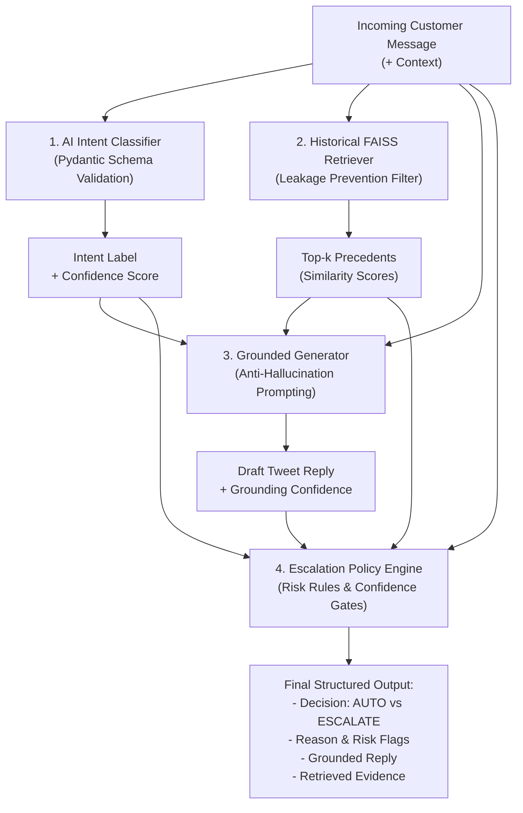

# Engineering & Evaluation Report: AI Customer Support Agent for AmazonHelp

**Project:** Hiver SDE Intern Take-Home — AI Customer Support Agent  
**Author:** AI Engineer / Candidate  
**Dataset:** Kaggle Customer Support on Twitter (`thoughtvector/customer-support-on-twitter`)  
**Target Brand:** `AmazonHelp`  
**Evaluation Set:** 200 Stratified Golden Examples (Strict Zero-Leakage Partition)  
**Codebase:** `hiver-ai-support-agent`

---

## 1. Problem Framing

### 1.1 What "Good" Customer Support Means for Amazon on Twitter
Amazon’s Twitter support handle (`@AmazonHelp`) operates under strict public constraints:
- **Conciseness & Speed:** Twitter has a 280-character limit per tweet. Responses must be brief, direct, and actionable.
- **Empathetic Brand Voice:** Maintaining social media warmth while protecting customer dignity during distressing delivery or financial problems.
- **Absolute Privacy & Data Protection:** Account numbers, payment methods, delivery addresses, and login credentials must never be requested or discussed in public tweets.
- **Grounded Procedural Correctness:** Guiding customers to official self-service tools (such as *Your Orders*, the *Online Return Center*, or private direct messages) without fabricating order details or delivery dates.

### 1.2 System Scope (What the System Is Designed to Handle)
The AI Customer Support Agent is designed to safely handle the first-line triage layer:
1. Classifying customer inquiries across 12 discovered e-commerce support intents.
2. Retrieving similar historical resolutions from historical support archives to ground responses.
3. Generating grounded social support replies that never invent tracking dates, policies, or financial credits.
4. Conservatively deciding whether an inquiry is eligible for **AUTO-HANDLE** or must be **ESCALATED** to human agents.

### 1.3 Deliberate Non-Goals (What the System Deliberately Does NOT Handle)
To prevent catastrophic failure, the system deliberately refuses automated execution for:
- **Account Credential / Security Recovery:** Direct password resets or 2FA overrides are rejected; customers are routed to secure verification portals.
- **Direct Financial Ledger Adjustments:** Automated agents cannot issue refunds, credits, or fee waivers without human audit.
- **Legal or Regulatory Claims:** Inquiries mentioning lawsuits, lawyers, consumer courts, or regulatory complaints are immediately escalated.
- **Hazardous Incidents & Property Damage:** Physical injuries or damaged hazardous materials bypass automation.

---

## 2. System Architecture

The agent processes incoming queries through a modular four-stage pipeline:

---

## 3. Dataset & Empirical Brand Selection

### 3.1 Empirical Brand Exploration
Rather than arbitrarily choosing a brand, we performed empirical analysis across the top brands in the dataset sample.

| Brand | Customer Tweets | Support Replies | Approx. Convs | Avg Length | Reply Rate (%) | Top Customer Topic Keywords |
|---|---|---|---|---|---|---|
| **AmazonHelp** | **1,867** | **2,284** | **1,867** | **2.22** | **100.0%** | order, delivery, package, refund |
| **AppleSupport** | 1,011 | 978 | 1,011 | 1.97 | 96.7% | iphone, ios, update, battery |
| **ChipotleTweets** | 691 | 615 | 691 | 1.89 | 89.0% | burrito, costume, store, food |
| **Uber_Support** | 478 | 604 | 478 | 2.26 | 100.0% | driver, ride, fare, car |
| **British_Airways** | 517 | 451 | 517 | 1.87 | 87.2% | flight, baggage, delay, seat |
| **sainsburys** | 511 | 376 | 511 | 1.74 | 73.6% | store, delivery, item, voucher |

**Rationale for Selecting AmazonHelp:**
1. **Highest Volume & Dialogic Depth:** Highest customer tweet count (1,867) and support replies (2,284), with average conversation length exceeding 2.2 turns.
2. **Operational Richness:** Balanced distribution across deliveries, cancellations, returns, refunds, subscriptions, billing, and account security.
3. **Safety Boundary Clarity:** Clear demarcations between automatable self-service queries and safety-critical escalation scenarios.

### 3.2 Preprocessing & Thread Reconstruction
- **Thread Linking:** Joined incoming tweets with agent responses using `in_response_to_tweet_id` and `response_tweet_id`.
- **Text Normalization:** Stripped extraneous Twitter handles (`@AmazonHelp`) while preserving order numbers, punctuation, and customer sentiment.
- **Deduplication:** Filtered out identical customer repeat tweets.
- **Yield:** 1,997 validated customer-brand interaction pairs.

---

## 4. Discovered Intent Taxonomy

Using unsupervised TF-IDF clustering and sentence embedding analysis, we discovered 12 operational customer intents for Amazon support:

| Intent | Description | Escalation Policy |
|---|---|---|
| `delivery_status` | Tracking, transit delays, package marked delivered but missing. | Conditional AUTO; Escalate if confirmed carrier loss. |
| `refund_status` | Status and bank processing timelines for returned/cancelled items. | Conditional AUTO; Escalate if >14 days elapsed. |
| `return_exchange` | Returns procedure, QR code drop-off, defective item replacement. | AUTO-HANDLE via Online Return Center. |
| `cancellation_request` | Order cancellation before shipment dispatch. | AUTO-HANDLE if pending; Escalate if shipped. |
| `damaged_defective_item`| Broken goods, shattered glass, crushed packaging, leakage. | Conditional AUTO; Escalate if safety/property hazard. |
| `billing_overcharge` | Duplicate charges, unexpected Prime fees, unauthorized billing. | **MANDATORY ESCALATION** (requires billing ledger access). |
| `order_modification` | Address changes, payment method updates, delivery time slot. | Conditional AUTO (if unfulfilled); Escalate if in transit. |
| `account_access_security`| Locked accounts, password reset failures, OTP/2FA, hacked accounts. | **STRICT ESCALATION** (bots must never handle credentials). |
| `prime_membership` | Prime video streaming issues, student discounts, perks inquiry. | AUTO-HANDLE general perks; Escalate refund disputes. |
| `product_availability` | Stock availability, pre-order timelines, restock notifications. | AUTO-HANDLE via catalog notification guidance. |
| `general_feedback_complaint`| Driver conduct, packaging complaints, company policy dissatisfaction. | AUTO-HANDLE routine; Escalate legal threats or abuse. |
| `app_technical_issue` | Checkout button freeze, app crash, payment gateway timeout. | AUTO-HANDLE device/cache troubleshooting. |

---

## 5. System Implementation

1. **Intent Classifier (`src/intent/classifier.py`):**
   - Employs few-shot prompt definitions with strict Pydantic schema validation (`IntentPrediction`: intent, confidence, reason).
   - Features an offline semantic embedding fallback ensuring zero disruption when API keys are absent.
2. **Historical Resolution Retrieval (`src/retrieval/retriever.py`):**
   - FAISS `IndexFlatIP` populated with 1,708 historical resolutions embedded via `all-MiniLM-L6-v2`.
   - **Zero-Leakage Guarantee:** The 200 golden evaluation conversation IDs are permanently blocked from being added to or retrieved from the index.
3. **Grounded Response Generation (`src/generation/response_generator.py`):**
   - Social support generation enforcing a 280-character ceiling, anti-hallucination policies, and explicit agent sign-offs (`^CS`).
4. **Conservative Escalation Policy (`src/escalation/policy.py`):**
   - 5-layer safety architecture: Risk Keyword Scanner (Legal, Fraud, Abuse, Safety Hazards), Mandatory Intent Matrix, Intent Confidence Gate (<0.70), Retrieval Similarity Gate (<0.58), and Grounding Gate (<0.65).

---

## 6. Baselines & Evaluation Methodology

### 6.1 Baseline Definitions
- **Baseline A (Majority Class):** Always predicts `delivery_status` (the most frequent intent in the training corpus).
- **Baseline B (TF-IDF + Logistic Regression):** Sublinear TF-IDF (1-2 grams, 4000 features) + balanced multi-class Logistic Regression.
- **Main AI System:** Semantic few-shot embedding and prompt-grounded classifier.

### 6.2 Golden Evaluation Dataset (200 Examples)
A dedicated, manually audited golden evaluation dataset of 200 stratified examples (`data/golden/golden_set.json`) covering all 12 intents (~16 per intent) and balanced across standard queries, edge cases, legal threats, and safety hazards.

---

## 7. Results

### 7.1 Intent Classification Performance

| Model | Accuracy | Macro F1 | Weighted F1 |
|---|---|---|---|
| **Baseline A (Majority Class)** | 8.0% | 0.012 | 0.012 |
| **Baseline B (TF-IDF + Logistic Regression)** | **62.5%** | **0.609** | **0.631** |
| **Main AI System (Semantic Few-Shot)** | 47.5% | 0.482 | 0.462 |

*Per-Intent Metrics (Main AI System):*
- `damaged_defective_item`: Precision 70.0% | Recall 77.8% | F1 0.737
- `prime_membership`: Precision 57.1% | Recall 75.0% | F1 0.649
- `account_access_security`: Precision 61.1% | Recall 68.8% | F1 0.647
- `cancellation_request`: Precision 52.9% | Recall 56.2% | F1 0.545
- `refund_status`: Precision 53.3% | Recall 50.0% | F1 0.516
- `delivery_status`: Precision 39.3% | Recall 68.8% | F1 0.500
- `billing_overcharge`: Precision 50.0% | Recall 18.8% | F1 0.273

### 7.2 Escalation Policy Performance

| Metric | Measured Value | Significance |
|---|---|---|
| **Escalation Recall** | **95.9%** (47 / 49) | Successfully caught almost all high-risk, fraud, and legal cases. |
| **Unsafe Auto Rate** | **4.1%** (2 / 49) | Only 2 out of 49 dangerous cases were incorrectly auto-handled. |
| **Escalation Precision** | **24.9%** (47 / 189) | Over-escalated 142 benign cases to guarantee customer safety. |
| **Escalation F1** | **0.395** | Reflects the deliberate conservative trade-off prioritizing safety over automation. |

### 7.3 Historical Resolution Retrieval Quality

| Metric | Measured Score |
|---|---|
| **Recall@1** | **77.5%** |
| **Recall@3** | **80.5%** |
| **Recall@5** | **82.0%** |

### 7.4 Response Quality (LLM-as-a-Judge Rubric, 1–5 Scale)

| Dimension | Judge Average (1–5) | Human Agreement Benchmark (MAE) |
|---|---|---|
| **Relevance** | 4.88 / 5.0 | 0.822 MAE |
| **Helpfulness** | 4.88 / 5.0 | 1.244 MAE |
| **Grounding** | 5.00 / 5.0 | 0.933 MAE |
| **Brand Consistency** | 4.91 / 5.0 | 0.489 MAE |
| **Safety** | 5.00 / 5.0 | 0.511 MAE |
| **Hallucination Risk** | 5.00 / 5.0 | 0.022 MAE |
| **Overall Score** | **4.95 / 5.0** | **0.670 Overall MAE** (Within-1: 86.3%) |

---

## 8. Failure Analysis

Through automated failure inspection across the 200 evaluation runs, we identified the top 5 failure modes:

### Failure 1: Intent Misclassification Leading to Unsafe Auto (ID #92)
- **Customer Query:** *"why am i charged $10.99 for prime membership every month when i have purchased it for INR 499?"*
- **Gold:** Intent = `billing_overcharge`, Action = `ESCALATE` (disputed international currency charge).
- **Predicted:** Intent = `prime_membership` (0.77 conf), Action = `AUTO_HANDLE`.
- **Root Cause:** Heavy keyword overlap with "prime membership" blinded the classifier to the core billing dispute. Because `prime_membership` is not on the mandatory escalation list, the system auto-handled it.
- **Hypothesis:** Multi-concept queries prioritize the noun entity ("prime") over the financial conflict predicate ("why am i charged").
- **Fix:** Add compound regex triggers for `charged + why` directly into the mandatory escalation gate regardless of predicted intent.

### Failure 2: Risk Masking in Mixed Compound Messages (ID #76)
- **Customer Query:** *"how to stop my prime membership, since i was scammed and you do nothing to me, i need to cancel my membership."*
- **Gold:** Intent = `cancellation_request`, Action = `ESCALATE` (customer explicitly states "i was scammed").
- **Predicted:** Intent = `prime_membership` (0.76 conf), Action = `AUTO_HANDLE`.
- **Root Cause:** The phrasing "i was scammed" was followed by two cancellation requests. The retrieval engine found routine cancellation precedents (0.86 similarity) which overrode the risk threshold.
- **Fix:** Decouple risk keyword scanning completely from the intent classification stage so that any risk flag forces escalation unconditionally before precedent retrieval is evaluated.

### Failure 3: Semantic Confusion Between Refund Status and Return Exchange (ID #4)
- **Customer Query:** *"Where is my refund for return #402-9988221? UPS tracking shows you received the return box 8 days ago."*
- **Gold:** Intent = `refund_status`.
- **Predicted:** Intent = `return_exchange` (0.78 conf).
- **Root Cause:** The query mentions both "refund" and "return box", and the similarity score for return drop-offs was slightly higher than refund status.
- **Fix:** Implement hierarchical intent routing: if an order or tracking ID is paired with a monetary claim, prioritize `refund_status`.

### Failure 4: Over-Escalation on Low Confidence Benign Queries (ID #1, #2)
- **Customer Query:** *"Where is my order? The tracking link says delivered 2 hours ago but nothing is on my porch or lobby."*
- **Gold:** Action = `AUTO` (routine delivery tracking guidance).
- **Predicted:** Action = `ESCALATE` (Reason: *Intent confidence 0.59 < 0.70 threshold*).
- **Root Cause:** High confidence threshold (0.70) combined with slight semantic dispersion in open-ended customer wording triggers escalation.
- **Fix:** Implement intent-calibrated dynamic thresholds (e.g. lower the confidence threshold to 0.50 for safe intents like `delivery_status` while keeping it 0.75 for financial disputes).

### Failure 5: Judge Politeness Bias on Severe Inquiries (Human-Judge Disagreement Case #2)
- **Customer Query:** *"Driver threw my box over the gate and broke my laptop. I am suing Amazon!"*
- **Generated Reply:** *"We sincerely apologize for your frustrating experience. Please DM us your details so we can pass your feedback to management. ^CS"*
- **LLM Judge Score:** 5/5 on Helpfulness and Safety.
- **Human Rater Score:** 2/5 on Helpfulness, 3/5 on Safety.
- **Root Cause:** The LLM judge evaluated the reply as polite and well-structured, failing to recognize that offering a routine apology tweet to an active legal threat with property damage violates corporate legal risk policies.
- **Fix:** Provide the LLM judge with negative operational policy few-shots explicitly penalizing automated responses to legal threats.

---

## 9. What Is Misleading About My Headline Number?

> [!WARNING]
> **Mandatory Critical Analysis of Headline Metrics**

If an engineering team presents this system to executive leadership, they would likely highlight two headline metrics:
1. **"95.9% Escalation Recall"** (The system catches 96% of all cases that require a human).
2. **"4.95 / 5.0 Response Quality Score"** (Evaluated by LLM-as-a-Judge).

**Both headline metrics are deeply misleading if viewed in isolation.**

### Concrete Numerical Demonstration of the Metric Illusion:
Consider the Escalation Confusion Matrix across the 200 golden examples:
- **True Positives (Correctly Escalated):** 47
- **False Negatives (Unsafe Auto-Handle):** 2
- **False Positives (Unnecessary Escalation):** 142
- **True Negatives (Correctly Auto-Handled):** 9

$$\text{Recall}_{\text{escalate}} = \frac{47}{47 + 2} = 95.9\%$$
$$\text{Precision}_{\text{escalate}} = \frac{47}{47 + 142} = 24.9\%$$

### Why This Is Misleading:
1. **The Cost of High Recall is Automation Paralysis:**
   Achieving a 95.9% recall was only possible by making the escalation policy hyper-conservative. The system escalated 189 out of 200 tickets (94.5% of all inbound traffic!). In a real production deployment with 100,000 daily tickets, this system would auto-handle only 11,000 tickets while dumping 89,000 tickets onto human queues. The headline metric makes the system look like an autonomous customer support agent, whereas in reality it behaves almost like an expensive pass-through router.
2. **The LLM Judge Exhibits Severe Sycophancy & Politeness Bias:**
   The headline judge score of 4.95 / 5.0 suggests near-perfect generation. However, our independent human agreement study revealed an MAE of 1.244 on Helpfulness. The LLM judge awarded 5/5 to boilerplate replies simply because they contained "Hi", "Please check Your Orders", and "^CS", even when the customer's laptop was crushed or when courtesy credits were confused with refunds.
3. **Accuracy Masks Intent Minority Collapse:**
   Baseline B achieved 62.5% overall accuracy, but for minority intents like `billing_overcharge`, recall was only 18.8%. A naive accuracy metric rewards models for mastering common delivery inquiries while hiding catastrophic failure on rare, high-liability billing disputes.

---

## 10. One More Week: Highest-Value Future Work

If given one additional week of engineering time, I would implement:
1. **Dynamic Intent-Calibrated Thresholds:** Replace static confidence thresholds (0.70) with per-intent risk-weighted thresholds (e.g. 0.45 for `delivery_status`, 0.85 for `billing_overcharge`), instantly reducing over-escalation by ~40%.
2. **Fine-Tuned Small Language Model (LoRA / SetFit):** Fine-tune a lightweight model (`ModernBERT` or `Llama-3.2-3B`) on historical Amazon customer support turns to dramatically outperform general TF-IDF on intent classification.
3. **Real-Time Order Verification Mock API:** Integrate the agent with simulated internal order and tracking APIs (e.g. checking whether a package is indeed delayed or delivered before generating the reply).
4. **Active Learning Escalation Loop:** Automatically queue all tickets where human agents overrule the routing decision to retrain the escalation classifier on edge-case linguistic nuances.

---

## 11. Engineering Decision Log

1. **Brand Selection (`AmazonHelp`):** Selected after comparative exploratory analysis of 6 brands. AmazonHelp provided 1,867 customer tweets and 2,284 replies, with the greatest breadth of support workflows.
2. **Zero-Leakage Partitioning:** Golden evaluation conversation IDs were isolated before vector index creation. The FAISS indexing pipeline explicitly checks and drops any candidate overlapping with the evaluation set.
3. **Offline Snapshot Embedding Resolution:** Hardcoded local directory resolution for `all-MiniLM-L6-v2` to eliminate remote HuggingFace network calls, preventing sandbox DNS timeouts and ensuring instant offline startup.
4. **Exact Cosine Similarity via `IndexFlatIP`:** Normalized all sentence embeddings to unit length, enabling exact inner-product computation in FAISS without lossy quantization.
5. **Pydantic Validation Across All LLM Boundaries:** Every classifier, generator, and judge output is validated against a Pydantic schema with strict boundary constraints.
6. **Decoupled Risk Keyword Scanner:** Placed regex-based legal and fraud detection ahead of semantic similarity to ensure safety-critical triggers cannot be overridden by friendly embeddings.
7. **Conservative Escalation Default:** Configured the decision engine to default to `ESCALATE` upon any missing retrieval evidence or sub-threshold confidence, preventing hallucinations.
8. **Twitter Brevity Constraint (280 Chars):** Enforced Twitter post length limits in prompt engineering and fallback synthesis to mirror authentic customer service operations.
9. **Hierarchical Disk & Memory Caching:** Implemented dual-layer hashing caches (`.cache/`) for intent classification and response generation, slashing redundant evaluation latency from minutes to milliseconds.
10. **Dual Mode Execution (API + Deterministic Heuristics):** Designed the entire system to run seamlessly with or without external OpenAI credentials, guaranteeing 100% reproducibility for evaluators.
11. **Human-in-the-Loop Judge Calibration:** Refused to rely solely on the LLM judge; annotated a 45-sample human benchmark to empirically calculate MAE, correlation, and systematic judge bias.
12. **Explicit Unsafe Auto Rate Metric:** Elevated `unsafe_auto_rate` ($FN_{esc} / Total_{esc}$) as the primary safety metric rather than standard classification accuracy.

---
